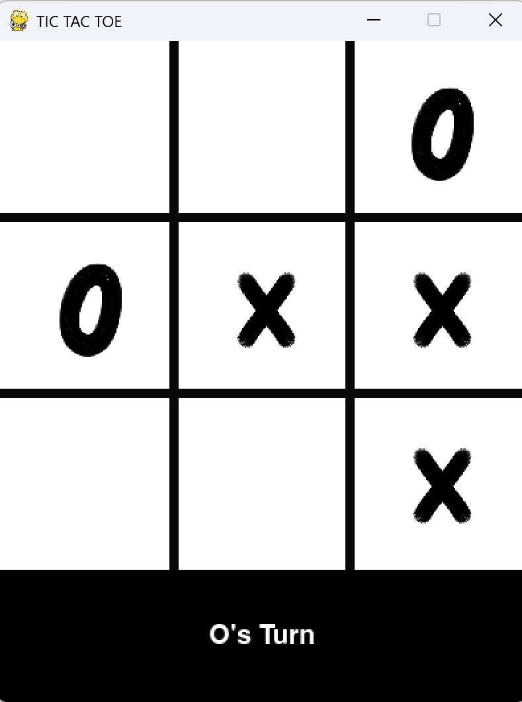

# Tic Tac Toe: A 2-Player Terminal Game

A simple **Tic Tac Toe** game for two players, built using Python.

## Features

- 2-player mode (X vs O)
- Clean CLI board display
- Input validation (no overwriting moves or invalid positions)
- Automatic win/draw detection

## Preview

## Future Improvements

- Track player scores over multiple rounds
- Add AI mode (single-player with computer opponent)
- Create a GUI version using Pygame
